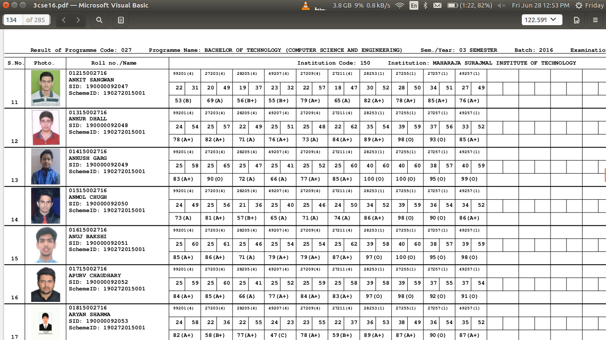
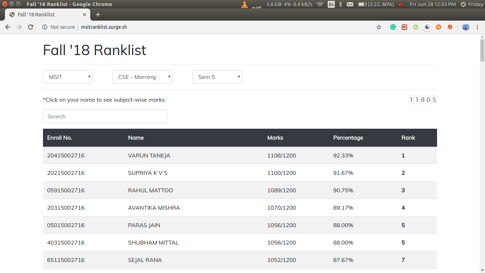
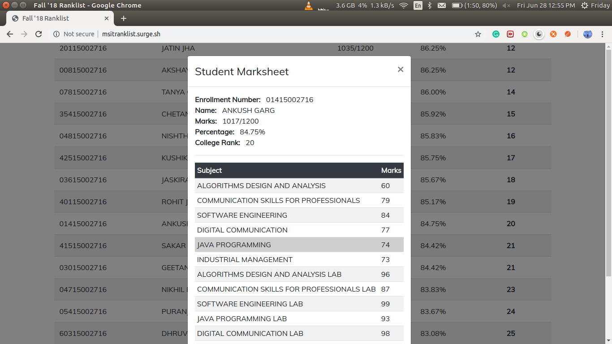

# msit-ranklist (Fall'18)

📉 The MSIT Ranklist for Fall'18 Results. 🎉 Got viral in MSIT, recieved 11,000+ hits.

## Why a ranklist app?
So the idea is simple. We recieve our semester-wise results in the form of a pdf, which looks like this:

There's Roll Number-wise, Subject-wise result of each and every student studying in a branch (CSE for instance) in the entire university (that's right, not just one college). Neither total marks nor percentage is displayed, let alone a ranklist. Even the subject names are not shown corresponding to the marks.

So this is just a minimalist result website I made for our college students, in which they can see their class-rank, percentage and subject-wise marks.

## How did I make it?

- **STEP 1:** Firstly, I needed the data form the PDF in any programming language (Javascript in my case). For this I used the [PDF.js library](https://mozilla.github.io/pdf.js/). It asynchronously gives me the raw text of any page in a PDF.

- **STEP 2:** Now, only from these raw text strings, I needed to generate meaningful data. But this is not an easy task, because in a single PDF there are hundreds of pages, thousands of students from different colleges. And the biggest problem is how inconsistent this data is. There are pages in the pdf which are blank, there are pages which only have info about subjects, there are students who didn't attend the exam, there are students who were given grace marks for passing, there are students from previous years giving back exams, there are, well, you get it... there are a lot of exceptions to handle and the data is really sensitive. I mean there's a high chance, I might end up showing someone else's marks under someone else's name, which will not only fail the purpose of the app, but also get me beaten up 👊 at my own college 😶.

- **STEP 3:** So, to handle this painful but logical task I wrote an algorithm. Let's call it Jimmy. This algorithm gets a name for itself because, it was very difficult to write and took a very long time to perfect. Now what Jimmy does is, it takes this inconsistent raw data page-by-page from a PDF and parses into meaningful array of objects, each object containing data and marks of a student. **Jimmy's CODE is not public right now for obvious reasons. 🙊**

- **STEP 4:** Great, so now that I have an array of objects, per PDF, I need to store it in a database. MongoDB was an obvious choice. Designing the models in MongoDb was a difficult task too, because a small redundancy in the database will eventually end up being super large because of large number of students. So I had to create separate Models for Colleges, Subjects (Subject-Code, Paper-Id, Subject-Name), Students-Marks, Courses(CSE, IT, ECE, EEE), etc.

- **STEP 5:** Well, the results were nearby so I didn't have enough time to make and API and write the entire code for the front-end. So I decided to make a minimalist, one-page application for only our college which consisted of the result of only Fall'18 Exams(all years + all branches + both shifts). 

- **STEP 6:** Showed it to my dad, who was like, "Working vagera sab theek hai, dikhne me achi ni hai. Aur ha, ek counter laga jisse pata lage ki kitne logo ne site visit ki hai.". So I added a hit counter, some Bootstrap, made it responsive, changed the default font and basically made it look a little professional. Which I ended up being appreciated a lot for. So, Thanks Dad.

- **STEP 7:** Texted my juniors and friends to directly call me as soon as results are out, and configured Jimmy enough, so that it'd not take me more than 5 mins to get the it up and running, once the results were out.

- **STEP 8:** As soon as the results got out, within 5 minutes the web-app was up and running at http://msitranklist.surge.sh . Then there was publicity, I wanted everyone in the college to know that they can find their, subjectwise-result, percentage, class-rank at this website. So I texted everyone I knew even remotely with a line that said "Please post this in your class group as well, thanks". Big thanks ❤️ to the brilliant friends I have who even posted stories about this.

- **STEP 9:** Sit Back and watch the Hit Counter go crazy for hours. Got 500+ hits within the first two hours. It has gone over 11,000 hits 🎉 and still counting. 

## What now?

Two things basically:

1. I'll try to lauch a version of this every-time the results are out (each time, better than the previous one), so that no-one has to go back to searching their name on the PDF, then sitting with a pen and calculator to calculate their percentage and ask their friends, how much did they get?
   
2. Already working on a much bigger version of this web-app, which can cover all engineering colleges under GGSIPU (all branches) and can show the profile of each and every student with the entire history of their marks in all the semesters.

3. **Also, If you would like some features or some changes in this, feel free to raise an issue.**